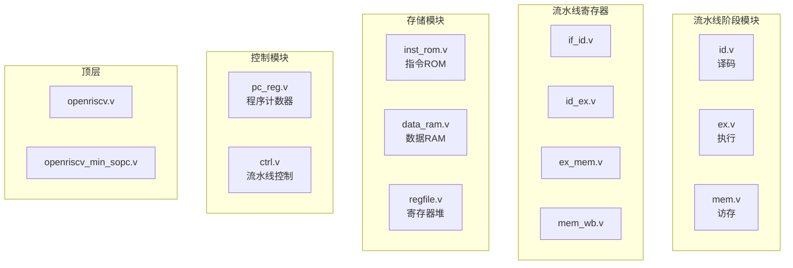

# RISC-V 流水线 CPU 深度代码架构分析

本文档将从**架构层面**深入剖析这个 CPU 工程的代码组织、数据流动和设计思想，帮助你真正理解每一行代码存在的意义。

---

## 目录

1. [工程全局视角](#第一部分工程全局视角)
2. [信号命名规范与数据类型](#第二部分信号命名规范与数据类型)
3. [模块间连接关系详解](#第三部分模块间连接关系详解)
4. [数据流动完整追踪](#第四部分数据流动完整追踪)
5. [核心机制深度解析](#第五部分核心机制深度解析)
6. [指令执行完整案例](#第六部分指令执行完整案例)

---

## 第一部分：工程全局视角

### 1.1 模块分类

这个 CPU 由 **12 个 Verilog 模块**组成，可分为 5 类：



### 1.2 文件职责速查表

| 文件 | 职责 | 输入 | 输出 | 复杂度 |
|------|------|------|------|--------|
| [openriscv/openriscv.srcs/sources_1/imports/code/define.v](openriscv/openriscv.srcs/sources_1/imports/code/define.v) | 宏常量定义 | - | - | ⭐ |
| [openriscv/openriscv.srcs/sources_1/imports/code/pc_reg.v](openriscv/openriscv.srcs/sources_1/imports/code/pc_reg.v) | 程序计数器 | 时钟、分支信号 | PC 地址 | ⭐⭐ |
| [openriscv/openriscv.srcs/sources_1/imports/code/if_id.v](openriscv/openriscv.srcs/sources_1/imports/code/if_id.v) | IF/ID 流水线寄存器 | PC、指令 | 延迟后的 PC、指令 | ⭐⭐ |
| [openriscv/openriscv.srcs/sources_1/imports/code/id.v](openriscv/openriscv.srcs/sources_1/imports/code/id.v) | 指令译码 | 指令 | 控制信号、操作数 | ⭐⭐⭐⭐⭐ |
| [openriscv/openriscv.srcs/sources_1/imports/code/regfile.v](openriscv/openriscv.srcs/sources_1/imports/code/regfile.v) | 32 个通用寄存器 | 读/写地址 | 寄存器值 | ⭐⭐⭐ |
| [openriscv/openriscv.srcs/sources_1/imports/code/id_ex.v](openriscv/openriscv.srcs/sources_1/imports/code/id_ex.v) | ID/EX 流水线寄存器 | 译码结果 | 延迟后的译码结果 | ⭐⭐ |
| [openriscv/openriscv.srcs/sources_1/imports/code/ex.v](openriscv/openriscv.srcs/sources_1/imports/code/ex.v) | 执行/ALU | 操作数 | 运算结果/访存控制 | ⭐⭐⭐⭐ |
| [openriscv/openriscv.srcs/sources_1/imports/code/ex_mem.v](openriscv/openriscv.srcs/sources_1/imports/code/ex_mem.v) | EX/MEM 流水线寄存器 | 执行结果 | 延迟后的执行结果 | ⭐⭐ |
| [openriscv/openriscv.srcs/sources_1/imports/code/mem.v](openriscv/openriscv.srcs/sources_1/imports/code/mem.v) | 访存阶段 | 地址、数据 | 读出的数据/写 RAM | ⭐⭐⭐⭐ |
| [openriscv/openriscv.srcs/sources_1/imports/code/mem_wb.v](openriscv/openriscv.srcs/sources_1/imports/code/mem_wb.v) | MEM/WB 流水线寄存器 | 访存结果 | 写回数据 | ⭐⭐ |
| [openriscv/openriscv.srcs/sources_1/imports/code/ctrl.v](openriscv/openriscv.srcs/sources_1/imports/code/ctrl.v) | 流水线暂停控制 | 暂停请求 | 暂停信号 | ⭐⭐⭐ |
| [openriscv/openriscv.srcs/sources_1/imports/code/openriscv.v](openriscv/openriscv.srcs/sources_1/imports/code/openriscv.v) | 顶层连接 | 外部 I/O | 外部 I/O | ⭐⭐⭐ |

---

## 第二部分：信号命名规范与数据类型

### 2.1 命名规范

理解命名规范是读懂代码的关键：

```
信号名 = [模块前缀_] + 功能描述 + [_方向后缀]
```

| 后缀 | 含义 | 示例 |
|------|------|------|
| `_i` | 输入 (input) | `inst_i`（输入的指令） |
| `_o` | 输出 (output) | `wdata_o`（输出的写数据） |
| `_v` | 逻辑值 | `True_v`, `False_v` |

| 前缀 | 含义 | 示例 |
|------|------|------|
| `ex_` | 来自执行阶段 | `ex_wdata_i`（EX 阶段要写回的数据） |
| `mem_` | 来自访存阶段 | `mem_wreg_o`（MEM 阶段的写使能） |
| `wb_` | 来自写回阶段 | `wb_wd_i`（WB 阶段的目标寄存器） |
| `reg1_`/`reg2_` | 源操作数 1/2 | `reg1_data_i`（源寄存器 1 的值） |

### 2.2 关键数据类型（来自 define.v）

```verilog
// 总线宽度定义
`define InstAddrBus     31:0    // 指令地址：32位
`define InstBus         31:0    // 指令本身：32位
`define RegBus          31:0    // 寄存器数据：32位
`define RegAddrBus      4:0     // 寄存器地址：5位（0-31）
`define DataAddrBus     31:0    // 数据地址：32位
`define DataBus         31:0    // 数据：32位

// 指令类型 opcode
`define INST_TYPE_I     7'b0010011    // I型：立即数运算
`define INST_TYPE_R     7'b0110011    // R型：寄存器运算
`define INST_TYPE_L     7'b0000011    // L型：Load 指令
`define INST_TYPE_S     7'b0100011    // S型：Store 指令
`define INST_TYPE_B     7'b1100011    // B型：分支指令
```

### 2.3 指令集支持与测试程序

以当前代码实现为准，该 CPU 支持并在测试程序中覆盖：

- RV32I（37 条核心子集）：19 条算术/逻辑 + 2 条大立即数 + 8 条访存 + 8 条控制流
- RV32M（8 条）：mul/mulh/mulhsu/mulhu/div/divu/rem/remu
- Zbb 子集（5 条）：min/minu/max/maxu/andn

对应测试程序：

- [openriscv/openriscv.srcs/sources_1/imports/code/inst_rom.txt](openriscv/openriscv.srcs/sources_1/imports/code/inst_rom.txt)

---

## 第三部分：模块间连接关系详解

### 3.1 顶层连接图（openriscv.v）

下图展示了 [openriscv/openriscv.srcs/sources_1/imports/code/openriscv.v](openriscv/openriscv.srcs/sources_1/imports/code/openriscv.v) 中所有模块的连接关系：

```
┌──────────────────────────────────────────────────────────────────────────────────────┐
│                                  openriscv.v                                          │
│                                                                                       │
│  ┌────────────┐     ┌────────────┐     ┌────────────┐     ┌────────────┐             │
│  │  pc_reg    │────>│   if_id    │────>│     id     │────>│   id_ex    │             │
│  │  PC寄存器   │ pc  │  流水线寄存器 │inst │   译码器    │     │  流水线寄存器 │             │
│  └────────────┘     └────────────┘     └─────┬──────┘     └─────┬──────┘             │
│        ↑                  ↑                  │                  │                    │
│        │                  │                  │ reg1_addr        │                    │
│        │        branch_flag                  │ reg2_addr        ↓                    │
│        │                  │                  ↓             ┌────────────┐            │
│        │                  │            ┌─────────────┐     │     ex     │            │
│  branch_addr              │            │   regfile   │     │   执行器    │            │
│        ↑                  │            │  32个寄存器  │<────│   (ALU)    │            │
│        │                  │            └─────────────┘     └─────┬──────┘            │
│        └──────────────────┴────────────────────────────────────┬─┘                   │
│                                                                │                     │
│  ┌────────────┐     ┌────────────┐     ┌────────────┐     ┌────┴───────┐            │
│  │   mem_wb   │<────│    mem     │<────│   ex_mem   │<────┘            │            │
│  │  流水线寄存器 │     │   访存器    │     │  流水线寄存器 │                 │            │
│  └─────┬──────┘     └────────────┘     └────────────┘                 │            │
│        │                  ↑                                           │            │
│        │              ram_data                                        │            │
│        ↓                  │                                           │            │
│   [写回到 regfile]    [数据 RAM]                                       │            │
│                                                                       │            │
│  ┌────────────┐  stall_req_from_id/ex                                │            │
│  │    ctrl    │<─────────────────────────────────────────────────────┘            │
│  │  流水线控制                                                                      │
│  └────────────┘                                                                    │
│                                                                                    │
└────────────────────────────────────────────────────────────────────────────────────┘
```

### 3.2 数据旁路（Data Forwarding）路径

这是理解这个 CPU 最关键的部分！观察 [openriscv/openriscv.srcs/sources_1/imports/code/openriscv.v](openriscv/openriscv.srcs/sources_1/imports/code/openriscv.v) 中 `id` 模块的例化：

```verilog
id id0(
    // ...
    // 关键！EX 阶段的结果直接反馈给 ID 阶段
    .ex_wreg_i(ex_wreg_o),
    .ex_wdata_i(ex_wdata_o),
    .ex_wd_i(ex_wd_o),

    // 关键！MEM 阶段的结果也直接反馈给 ID 阶段
    .mem_wreg_i(mem_wreg_o),
    .mem_wdata_i(mem_wdata_o),
    .mem_wd_i(mem_wd_o),
    // ...
);
```

**这就是数据前推！** 当 ID 阶段发现要读的寄存器正在被前面的指令写入时，不用等写回完成，直接从 EX 或 MEM 阶段"偷看"结果。

---

## 第四部分：数据流动完整追踪

### 4.1 指令的完整旅程

以 `add x3, x1, x2` 为例追踪数据流：

```
┌─────────────────────────────────────────────────────────────────────────────────┐
│                           指令: add x3, x1, x2                                   │
│                           含义: x3 = x1 + x2                                     │
└─────────────────────────────────────────────────────────────────────────────────┘

周期1: 【取指 IF】
        ┌──────────────────────────────────────┐
        │ pc_reg 输出 PC = 0x00000004          │
        │ inst_rom 根据 PC 返回指令 0x002081b3 │
        └──────────────────────────────────────┘
                            ↓
周期2: 【译码 ID】
        ┌──────────────────────────────────────────────────────────────┐
        │ if_id 将指令传递给 id 模块                                    │
        │                                                              │
        │ id.v 解析 32 位指令：                                         │
        │   ┌─────┬─────┬─────┬───────┬─────┬─────────┐               │
        │   │funct7│ rs2 │ rs1 │funct3 │ rd  │ opcode  │               │
        │   │0000000│00010│00001│ 000   │00011│0110011  │               │
        │   └─────┴─────┴─────┴───────┴─────┴─────────┘               │
        │                                                              │
        │ 解析结果：                                                     │
        │   - opcode = 0110011 → R型指令                                │
        │   - funct3 = 000, funct7 = 0000000 → ADD 运算                 │
        │   - rs1 = 1 (x1), rs2 = 2 (x2), rd = 3 (x3)                  │
        │                                                              │
        │ regfile 读取：                                                │
        │   - reg1_data = x1 的值                                       │
        │   - reg2_data = x2 的值                                       │
        └──────────────────────────────────────────────────────────────┘
                            ↓
周期3: 【执行 EX】
        ┌──────────────────────────────────────────────────────────────┐
        │ id_ex 将操作数传递给 ex 模块                                   │
        │                                                              │
        │ ex.v 执行运算：                                               │
        │   wdata_o = reg1_i + reg2_i                                  │
        │           = x1 + x2                                          │
        │                                                              │
        │ 代码位置：ex.v 第 121 行                                       │
        │   `EXE_ADD_SUB: begin                                        │
        │       if (inst_i[30] == 1'b0) begin                          │
        │           wdata_o <= op1_add_op2;  // ADD                    │
        │       end                                                    │
        │   end                                                        │
        └──────────────────────────────────────────────────────────────┘
                            ↓
周期4: 【访存 MEM】
        ┌──────────────────────────────────────────────────────────────┐
        │ ADD 指令不需要访问内存                                         │
        │ mem.v 直接将 wdata_i 传递为 wdata_o                           │
        │                                                              │
        │ 代码位置：mem.v 第 150 行                                      │
        │   default: begin                                             │
        │       wdata_o <= wdata_i;  // 透传                           │
        │   end                                                        │
        └──────────────────────────────────────────────────────────────┘
                            ↓
周期5: 【写回 WB】
        ┌──────────────────────────────────────────────────────────────┐
        │ mem_wb 将结果传递给 regfile                                   │
        │                                                              │
        │ regfile.v 写入：                                              │
        │   regs[3] <= wdata  // x3 = x1 + x2 的结果                   │
        │                                                              │
        │ 代码位置：regfile.v 第 40-41 行                                │
        │   if ((we == `WriteEnable) && (wr_addr != 0)) begin          │
        │       regs[wr_addr] <= wr_data;                              │
        │   end                                                        │
        └──────────────────────────────────────────────────────────────┘
```

---

## 第五部分：核心机制深度解析

### 5.1 数据冒险与前推机制

**问题场景：**
```asm
add x1, x2, x3    # 指令 A：写入 x1
add x4, x1, x5    # 指令 B：读取 x1 ← 此时 x1 还没写回！
```

**解决方案：** 在 [openriscv/openriscv.srcs/sources_1/imports/code/id.v](openriscv/openriscv.srcs/sources_1/imports/code/id.v) 中实现数据前推

```verilog
// id.v 第 291-314 行：确定源操作数1
always @(*) begin
    if (rst == `RstEnable) begin
        reg1_o <= `ZeroWord;
    // 情况1：前一条是 load 指令，且目标寄存器就是我要读的 → 暂停流水线
    end else if (is_load_i == 1'b1 && ex_wd_i == reg1_addr_o
        && reg1_read_o == 1'b1) begin
        stallreq_for_reg1_loadrelate <= `Stop;  // 请求暂停
    // 情况2：EX 阶段正在写我要读的寄存器 → 直接用 EX 的结果
    end else if ((reg1_read_o == 1'b1) && (ex_wreg_i == 1'b1)
        && (ex_wd_i == reg1_addr_o)) begin
        reg1_o <= ex_wdata_i;   // 数据前推！
    // 情况3：MEM 阶段正在写我要读的寄存器 → 直接用 MEM 的结果
    end else if ((reg1_read_o == 1'b1) && (mem_wreg_i == 1'b1)
        && (mem_wd_i == reg1_addr_o)) begin
        reg1_o <= mem_wdata_i;  // 数据前推！
    // 情况4：正常读寄存器
    end else if (reg1_read_o == 1'b1) begin
        reg1_o <= reg1_data_i;
    end
end
```

### 5.2 Load-Use 冒险与流水线暂停

**问题场景：**
```asm
lw  x1, 0(x2)     # 从内存加载数据到 x1
add x3, x1, x4    # 立即使用 x1 ← 此时 x1 的值还在内存中！
```

**特殊性：** Load 指令要到 MEM 阶段才能拿到数据，前推无法解决，**必须暂停流水线一个周期**。

**实现位置：** [openriscv/openriscv.srcs/sources_1/imports/code/ctrl.v](openriscv/openriscv.srcs/sources_1/imports/code/ctrl.v)

```verilog
// 暂停信号说明：
// stall[0] = PC 保持不变
// stall[1] = IF 阶段暂停
// stall[2] = ID 阶段暂停
// stall[3] = EX 阶段暂停
// ...

always @(*) begin
    if (stall_req_from_id == `Stop) begin
        stall <= 6'b000111;  // IF、ID、EX 暂停，MEM/WB 继续
    end else if (stall_req_from_ex == `Stop) begin
        stall <= 6'b001111;  // IF、ID、EX、MEM 暂停
    end else begin
        stall <= 6'b0;       // 不暂停
    end
end
```

### 5.3 分支处理与流水线冲刷

**问题场景：**
```asm
beq x1, x2, label  # 如果 x1 == x2，跳转到 label
add x3, x4, x5     # 这条指令已经进入流水线了！
```

**解决方案：** 分支发生时，用空指令冲刷流水线

**实现位置：** [openriscv/openriscv.srcs/sources_1/imports/code/if_id.v](openriscv/openriscv.srcs/sources_1/imports/code/if_id.v)

```verilog
always @(posedge clk) begin
    if (rst == `RstEnable) begin
        id_pc <= `ZeroWord;
        id_inst <= `ZeroWord;
    // 发生分支时，用空指令覆盖当前指令
    end else if (branch_flag_i == `BranchEnable) begin
        id_pc <= `ZeroWord;
        id_inst <= `ZeroWord;  // NOP
    end else begin
        id_pc <= if_pc;
        id_inst <= if_inst;
    end
end
```

---

## 第六部分：指令执行完整案例

### 6.1 案例：指令覆盖测试程序

当前工程使用“指令覆盖测试程序”来验证 RV32I + RV32M + Zbb 子集指令的执行路径与写回结果。

- 测试程序： [openriscv/openriscv.srcs/sources_1/imports/code/inst_rom.txt](openriscv/openriscv.srcs/sources_1/imports/code/inst_rom.txt)
- 特点：每条指令后面都写了期望写回值/行为（便于快速对照波形验证）。

**流水线执行视图：**（示意）

```
周期:   1    2    3    4    5    6    7    8    9   10   11   12
────────────────────────────────────────────────────────────────
addi x1: IF  ID   EX  MEM   WB
addi x2:      IF   ID   EX  MEM   WB
addi x3:           IF   ID   EX  MEM   WB
add x3:                 IF   ID   EX  MEM   WB
                              ↑
                         这里需要读 x1, x2
                         但它们刚写回完成！
                         通过数据前推解决
addi x1:                      IF   ID   EX  MEM   WB
addi x2:                           IF   ID   EX  MEM   WB
jal:                                    IF   ID   EX  MEM   WB
(分支)                                       ↓
                                        冲刷后面的指令
add x3:                                      IF   ID   EX  MEM   WB
...
```

### 6.2 如何在仿真中验证？

在波形图中观察以下信号：

| 信号 | 预期变化 | 对应模块 |
|------|----------|----------|
| `wr_addr` / `wr_data` | 与 `inst_rom.txt` 注释的“写回预期”一致 | regfile.v |
| `ram_addr` / `ram_we` / `ram_data` | 与 lw/lb/lbu/lh/lhu 与 sw/sb/sh 行为一致 | data_ram.v / mem.v |
| `branch_flag` / `branch_addr` | jal/jalr/分支类指令跳转目标正确 | id.v |
| `stall` | 发生 load-use 冒险时暂停；本设计对 B 类指令也会触发暂停 | ctrl.v / id.v |

---

## 附录：快速定位指南

### 如何找到某条指令的处理代码？

1. **确定指令类型**：查看 [openriscv/openriscv.srcs/sources_1/imports/code/define.v](openriscv/openriscv.srcs/sources_1/imports/code/define.v) 中的 opcode/funct 定义
2. **译码阶段**：在 [openriscv/openriscv.srcs/sources_1/imports/code/id.v](openriscv/openriscv.srcs/sources_1/imports/code/id.v) 中搜索 `case(opcode)` / `case(funct3)`
3. **执行阶段**：在 [openriscv/openriscv.srcs/sources_1/imports/code/ex.v](openriscv/openriscv.srcs/sources_1/imports/code/ex.v) 中查看 RV32I/RV32M/Zbb 的执行逻辑
4. **访存阶段**：如果是 Load/Store，查看 [openriscv/openriscv.srcs/sources_1/imports/code/mem.v](openriscv/openriscv.srcs/sources_1/imports/code/mem.v)

### 常见调试入口点

| 问题 | 查看位置 | 关键信号 |
|------|----------|----------|
| 指令未执行 | id.v | `instvalid`, `wreg_o` |
| 结果错误 | ex.v | `wdata_o` |
| 寄存器未更新 | regfile.v | `we`, `wr_addr` |
| 流水线卡住 | ctrl.v | `stall` |
| 分支失败 | id.v & if_id.v | `branch_flag_o`, `branch_addr_o` |

---

> 💡 **建议阅读顺序：**
>
> 1. 先通读 `define.v` 理解所有宏定义
> 2. 从 `openriscv.v` 看模块连接关系
> 3. 深入 `id.v` 理解译码逻辑
> 4. 配合 `ex.v` 理解指令执行
> 5. 最后看 `ctrl.v` 理解流水线控制
